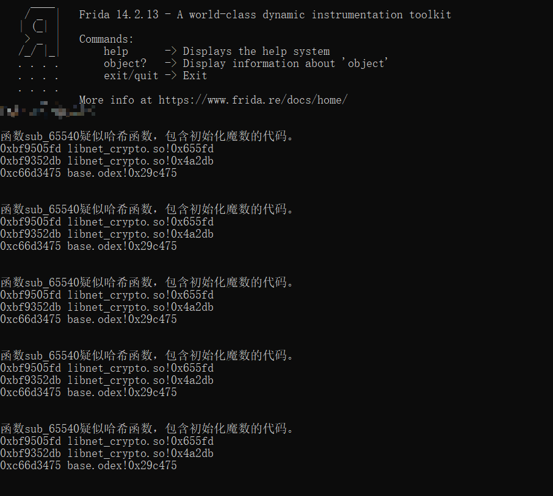
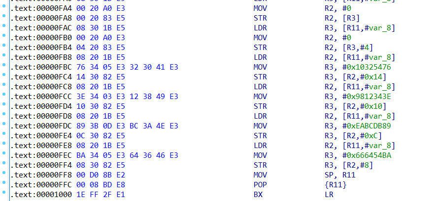
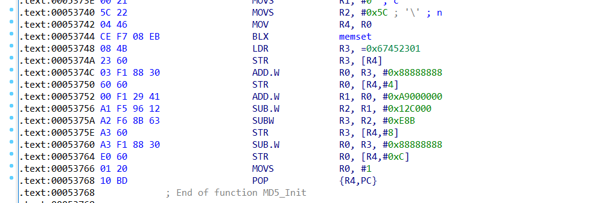
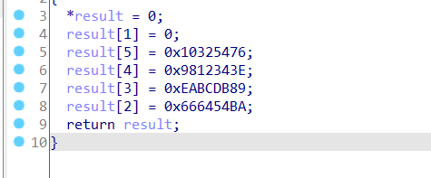
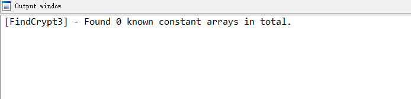

# findhash
在哈希算法上，比Findcrypt更好的检测工具，同时生成Frida hook代码。

### 使用方法
* 把findhash.xml和findhash.py扔到ida plugins目录下
* ida -edit-plugin-findhash

### 试图解决的问题
* 哈希函数的初始化魔数被修改
* 想快速验证所分析的函数中是否使用了MD5，SHA1、SHA2这些哈希算法。
* Findcrypt/Signsrch没找出来

可以应对如下各种findcrypt找不到或者哈希函数被魔改的情况

### 原理
通过正则表达式匹配伪C代码中的初始化魔数代码以及哈希运算函数，很粗鲁暴力，所以运行时间会比较长，因为要反编译所有函数，但对哈希算法的检测上效果非常nice。

### TODO
* 适配arm64
* 增加对特征常量立即数的搜索
* 增加对一个函数汇编中的位运算比例的计算，以及循环的识别。根据相关理论，高占比的位运算指令以及循环，是加解密算法难以抹去的结构特征。
